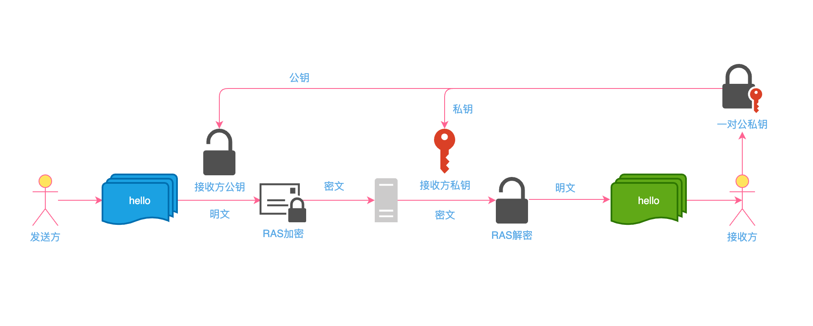

# 常用加密算法介绍

### 一、密码学简史
### 二、对称加密
### 三、非对称加密
### 四、Hash算法


<br />

## 一、密码学发展史

### 古典密码

<p>
古典密码学的历史可以追溯到公元 400 年前，斯巴达人发明的“塞塔式密码”是最早的密码技术，我国古代也早有以藏头诗、藏尾诗、漏格诗及绘画和藏宝图等密码表现形式，将要表达的真正意思或“密语”隐藏在诗文或画卷中特定位置的记载，一般人只注意诗或画的表面意境，而不会去注意或很难发现隐藏其中的“话外之音”。如口占四句卦歌：
</p>

```
芦花丛中一扁舟，
俊杰俄从此地游。 　　
义士若能知此理，
反躬难逃可无忧。
```
<p>
暗藏“卢俊义反”四字。结果，成了官府治罪的证据，终于把卢俊义“逼”上了梁山。
</p>
更广为人知的是唐伯虎写的“我爱秋香”：
<p>

```
我画蓝江水悠悠，
爱晚亭上枫叶愁。
秋月溶溶照佛寺，
香烟袅袅绕经楼。
```

</p>
<br />

### 几种古典密码学:
* 滚桶密码
* 掩格密码
* 棋盘密码
* 凯撒密码
* 弗纳姆密码
* 圆盘密码
* 维吉尼亚密码
* 换位密码

### 近代密码学

* 密码形成一门新的学科是在20世纪70年代，这是受计算机科学蓬勃发展刺激和推动的结果。
* Arthur Scherbius于1919年设计出了历史上最著名的密码机—德国的Enigma机，在二次世界大战期间， Enigma曾作为德国陆、海、空三军最高级密码机.
* 这一阶段真正开始源于香农在20世纪40年代末发表的一系列论文，特别是1949年的《保密系统通信理论》，把已有数千年历史的密码学推向了基于信息论的科学轨道。
* 近代密码发展中一个重要突破是“数据加密标准”（DES）的出现，DES密码的意义在于，从政府走向民间，其设计主要由IBM公司完成,最终经美国国家标准局公开征集遴选后，确定为联邦信息处理标准，并在美国联邦部门和金融等商业领域广泛使用。

### 现代密码学
* 1976 年，美国密码学家提出“公钥密码”概念。此类密码中加密和解密使用不同的密钥，其中，用于加密的叫做公钥，用于解密的为私钥。1977年，美国麻省理工学院提出第一个公钥加密算法RSA算法，之后ElGamal、椭圆曲线、双线性对等公钥密码相继被提出，密码学真正进入了一个新的发展时期。
* 随着计算能力的不断增强和因子分解算法的不断改进，特别是量子计算机的发展，公钥密码安全性也渐渐受到威胁。目前，研究者们开始关注量子密码、格密码等抗量子算法的密码，后量子密码等前沿密码技术逐步成为研究热点。


<br />
<br />

## 二、对称加密
<p>
在对称加密算法中，加密和解密使用的是同一把钥匙，即：使用相同的密匙对同一密码进行加密和解密；
</p>

### 加密过程
* 加密：原文 + 秘钥 = 密文
* 解密：密文 - 秘钥 = 原文

### 特点
* 优点：算法公开、计算量小、加密速度快、加密效率高。
* 缺点：在数据传送前，发送方和接收方必须约定好密钥，然后双方保存好密钥。如果一方的密钥被泄露，那么加密信息也就不安全了
* 使用场景：本地数据加密、https通信、网络传输等


### 常用算法：
* DES（Data Encryption Standard）：数据加密标准，速度较快，适用于加密大量数据的场合
* 3DES（Triple DES）：是基于DES，对一块数据用三个不同的密钥进行三次加密，强度更高
* AES（Advanced Encryption Standard）：高级加密标准，DES的升级版，是下一代的加密算法标准，速度快，安全级别高(微信小程序加密传输也是这种方式）


### 图解


### js开源库

[crypto-js](https://github.com/brix/crypto-js)

``` js

import CryptoJS from "crypto-js"
const message = 'Hello World';
const key = '123'

// 加密生成密文
const ciphertext = CryptoJS.AES.encrypt(JSON.stringify(message),key).toString();

// 解密得到明文
const bytes = CryptoJS.AES.decrypt(ciphertext, key);
const decryptedData = JSON.parse(bytes.toString(CryptoJS.enc.Utf8));

```

## 三、非对称加密算法
<p>
非对称加密算法需要两个密钥：公开密钥（publickey:简称公钥）和私有密钥（privatekey:简称私钥）。公钥与私钥是一对，如果用公钥对数据进行加密，只有用对应的私钥才能解密。因为加密和解密使用的是两个不同的密钥，所以这种算法叫作非对称加密算法。
</p>
<p>
非对称加密算法的密匙是通过一系列算法获取到的一长串随机数，通常随机数的长度越长，加密信息越安全。通过私钥经过一系列算法是可以推导出公钥的，也就是说，公钥是基于私钥而存在的。但是无法通过公钥反向推倒出私钥，这个过程的单向的。
</p>

### 特点
* 优点：非对称加密与对称加密相比其安全性更好
* 缺点：加密和解密花费时间长、速度慢，只适合对少量数据进行加密
* 使用场景：https会话前期、CA数字证书、信息加密、登录认证等
* 前提：首次通信时发送方接收了接收方的公钥，并保存在本地

### 常用算法
* RSA：由 RSA 公司发明，是一个支持变长密钥的公共密钥算法，需要加密的文件块的长度也是可变的
* DSA（Digital Signature Algorithm）：数字签名算法，是一种标准的 DSS（数字签名标准）
* ECC（Elliptic Curves Cryptography）：椭圆曲线密码编码学


### 图解


### js开源库
[jsencrypt](https://github.com/travist/jsencrypt)

``` js
// 使用公钥加密
var publicKey = '123';
var encrypt = new JSEncrypt();
encrypt.setPublicKey(publicKey);
var encrypted = encrypt.encrypt('Hello World');

// 使用私钥解密
var privateKey = '321';
var decrypt = new JSEncrypt();
decrypt.setPrivateKey(privateKey);
var uncrypted = decrypt.decrypt(encrypted);

```

## 四、Hash算法
<p>
Hash，一般翻译做“散列”，也有直接音译为“哈希”的，是把任意长度的输入（又叫做预映射， pre-image），通过散列算法，变换成固定长度的输出，该输出就是散列值。这种转换是一种压缩映射，也就是散列值的空间通常远小于输入的空间，不同的输入可能会散列成相同的输出，而不可能从散列值来唯一的确定输入值。
</p>
<p>
简单的说就是一种将任意长度的消息压缩到某一固定长度的消息摘要的函数。
</p>

### 特点
* 优点：不可逆、易计算、特征化
* 缺点：可能存在散列冲突
* 使用场景：文件或字符串一致性校验、数字签名、鉴权协议

### 常用算法
* MD5（Message Digest Algorithm 5）：是RSA数据安全公司开发的一种单向散列算法，非可逆，相同的明文产生相同的密文
* SHA（Secure Hash Algorithm）：可以对任意长度的数据运算生成一个160位的数值

### js开源库

[JavaScript-MD5](https://github.com/blueimp/JavaScript-MD5)

``` js
const hash = md5('Hello World');
```