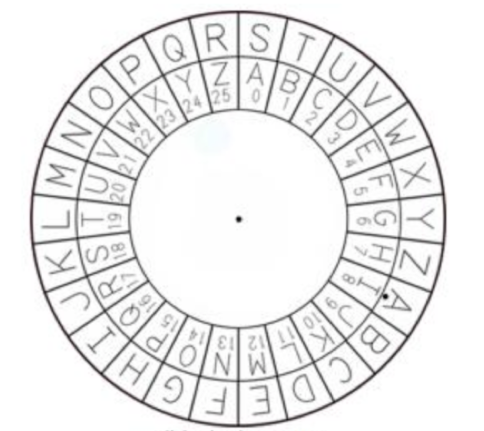

# 常用加密算法及详解

### 一、密码学简史
### 二、对称加密
### 三、非对称加密
### 四、Hash算法
### 五、量子加密


## 一、密码学发展史
<p>密码学的诞生，就是为了运用在战场，在公元前，战争之中出现了秘密书信。在中国历史上最早的加密算法的记载出自于周朝兵书《六韬.龙韬》中的《阴符》和《阴书》。
</p>
<br />
<p>
在西方，在希罗多德（Herodotus）的《历史》中记载了公元前五世纪，希腊城邦和波斯帝国的战争中，广泛使用了移位法进行加密处理战争通讯信息
</p>
<br />
<p>
相传凯撒大帝为了防止敌人窃取信息，就使用加密的方式传递信息。那么当时的加密方式非常的简单，就是对二十几个罗马字母建立一张对照表，将明文对应成为密文。那么这种方式其实持续了很久。甚至在二战时期，日本的电报加密就是采用的这种原始加密方式。
</p>

<br />
<br />
<p>
早期的密码学一直没有什么改进，几乎都是根据经验慢慢发展的。直到20世纪中叶，由香农发表的《秘密体制的通信理论》一文，标志着加密算法的重心转移往应用数学上的转移。于是，逐渐衍生出了当今重要的三类加密算法：非对称加密、对称加密以及哈希算法（HASH严格说不是加密算法，但由于其不可逆性，已成为加密算法中的一个重要构成部分）。
</p>
<br />
<p>
1976年以前，所有的加密方法都是同一种模式：加密和解密使用同样规则（简称"密钥"），这被称为  ` "对称加密算法" ` ，使用相同的密钥，两次连续的对等加密运算后会回复原始文字，也有很大的安全隐患。
</p>
<br />
<p>
1976年，两位美国计算机学家 Whitfield Diffie 和 Martin Hellman，提出了一种崭新构思，可以在不直接传递密钥的情况下，完成解密。这被称为"Diffie-Hellman密钥交换算法"。也正是因为这个算法的产生，人类终于可以实现非对称加密了。
</p>
<br />
<br />

## 二、对称加密
<p>
在对称加密算法中，加密和解密使用的是同一把钥匙，即：使用相同的密匙对同一密码进行加密和解密；
</p>

### 加密过程
* 加密：原文 + 秘钥 = 密文
* 解密：密文 - 秘钥 = 原文

### 特点
* 优点：算法公开、计算量小、加密速度快、加密效率高。
* 缺点：在数据传送前，发送方和接收方必须商定好密钥，然后双方保存好密钥。如果一方的密钥被泄露，那么加密信息也就不安全了
* 使用场景：本地数据加密、https通信、网络传输等


### 常用算法：
* DES（Data Encryption Standard）：数据加密标准，速度较快，适用于加密大量数据的场合。
* 3DES（Triple DES）：是基于DES，对一块数据用三个不同的密钥进行三次加密，强度更高。
* AES（Advanced Encryption Standard）：高级加密标准，DES的升级版，是下一代的加密算法标准，速度快，安全级别高(微信小程序加密传输也是这种方式）；


### 图解


### js开源库

[crypto-js](https://github.com/brix/crypto-js)

``` js

import CryptoJS from "crypto-js"
const message = 'Hello World';
const key = ''

// 加密生成密文
const ciphertext = CryptoJS.AES.encrypt(JSON.stringify(message),key).toString();

// 解密得到明文
const bytes = CryptoJS.AES.decrypt(ciphertext, key);
const decryptedData = JSON.parse(bytes.toString(CryptoJS.enc.Utf8));

```

## 三、非对称加密算法
<p>
非对称加密算法需要两个密钥：公开密钥（publickey:简称公钥）和私有密钥（privatekey:简称私钥）。公钥与私钥是一对，如果用公钥对数据进行加密，只有用对应的私钥才能解密。因为加密和解密使用的是两个不同的密钥，所以这种算法叫作非对称加密算法。
</p>
<p>
非对称加密算法的密匙是通过一系列算法获取到的一长串随机数，通常随机数的长度越长，加密信息越安全。通过私钥经过一系列算法是可以推导出公钥的，也就是说，公钥是基于私钥而存在的。但是无法通过公钥反向推倒出私钥，这个过程的单向的。
</p>

### 特点
* 优点：非对称加密与对称加密相比其安全性更好
* 缺点：加密和解密花费时间长、速度慢，只适合对少量数据进行加密
* 使用场景：https会话前期、CA数字证书、信息加密、登录认证等
* 前提：首次通信时发送方接收了接收方的公钥，并保存在本地

### 常用算法
* RSA：由 RSA 公司发明，是一个支持变长密钥的公共密钥算法，需要加密的文件块的长度也是可变的；
* DSA（Digital Signature Algorithm）：数字签名算法，是一种标准的 DSS（数字签名标准）；
* ECC（Elliptic Curves Cryptography）：椭圆曲线密码编码学。


### 图解


### js开源库
[jsencrypt](https://github.com/travist/jsencrypt)

``` js
// 使用公钥加密
var publicKey = '';
var encrypt = new JSEncrypt();
encrypt.setPublicKey(publicKey);
var encrypted = encrypt.encrypt('Hello World');

// 使用私钥解密
var privateKey = '';
var decrypt = new JSEncrypt();
decrypt.setPrivateKey(privateKey);
var uncrypted = decrypt.decrypt(encrypted);

```

## 四、Hash算法
<p>
Hash，一般翻译做“散列”，也有直接音译为“哈希”的，就是把任意长度的输入（又叫做预映射， pre-image），通过散列算法，变换成固定长度的输出，该输出就是散列值。这种转换是一种压缩映射，也就是，散列值的空间通常远小于输入的空间，不同的输入可能会散列成相同的输出，而不可能从散列值来唯一的确定输入值。
</p>
<p>
简单的说就是一种将任意长度的消息压缩到某一固定长度的消息摘要的函数。
</p>

### 特点
* 优点：不可逆、易计算、特征化
* 缺点：可能存在散列冲突
* 使用场景：文件或字符串一致性校验、数字签名、鉴权协议

### 常用算法
* RSA：由 RSA 公司发明，是一个支持变长密钥的公共密钥算法，需要加密的文件块的长度也是可变的；
* DSA（Digital Signature Algorithm）：数字签名算法，是一种标准的 DSS（数字签名标准）；
* ECC（Elliptic Curves Cryptography）：椭圆曲线密码编码学。

### js开源库

[JavaScript-MD5](https://github.com/blueimp/JavaScript-MD5)

``` js
const hash = md5('Hello World');
```